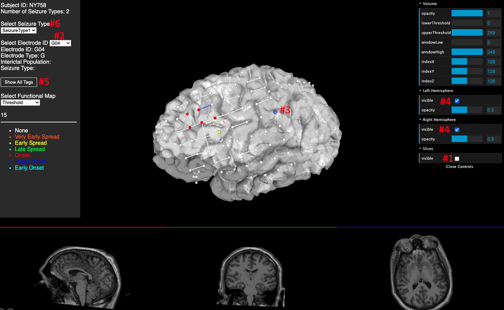

# N-Tools-Browser

**Web-based Electrode Visualization**

An add-on to [N-Tools-Elec](https://github.com/HughWXY/ntools_elec), based on [X Toolkit (XTK)](https://github.com/xtk/X).

## Demo (Beta)
- Visit [search page](https://jingyunc.github.io/ntools_browser/demo/files/umb_ntools/search.html). 
- Type "fsMNI" for SubjectID, select UMB mode, and click "Load Data!" button (as showed below).

- In 3D view: mouse-left = rotate, mouse-wheel = zoom, shift+mouse-left = move, left-click sphere or bar = select & display elec or fmap properties. 
- The orthogonal 2D slices in 3D view can be turned off by GUI (mark #1 in screenshot).
- The elec ID menu (#2) and 3D spheres (#3) are synchronized, selecting one will update the other.
- Some elec spheres and fmap bars may be beneath brain surface un-selectable, you can turn off brain surface (#4) to select them.
- Moving mouse cursor to an elec in 3D view will show its ID tags. Clicking #5 shows all ID tags.

 
## Stage 1: Visualize brain surfaces and electrodes in browser from existing ntools_elec outputs
- [x] Find toolbox for web-based visualization of Freesurfer files.
- [x] Create database of existing MRI scans and electrode coordinates for web visualization.
- [x] Convert ntools_elec outputs to XTK compatible format.
- [x] Create web service for accessing ntools_elec outputs.
## Stage 2: Edit and save attributes of electrodes in browser
- [x] Create GUI for subject selection and 3D redering options.
- [ ] Assign and save different atrributes to the electrodes (e.g. functional mapping, seizure mapping, resection mapping, etc.).
## Stage 3: Add user control
- [ ] Link to MCIT database of Kerbros ID/Password.
- [ ] Create white list of Kerbros ID for legit users.
## Suggested features
- [x] Render brain volume instead of cortical surface.
- [x] Opacity control of brain surface
- [x] Color-code fmap bars
- [x] Display legend for color-code
- [x] Color-code elecs on 2D slices
- [x] Additional draw-down menu items for different types of fmap findings
- [ ] Adopt BIDS format in json file
- [x] 3D tags
- [ ] Show multiple fmap bars for same elec-pairs
- [ ] Interpolate surface color with electrode attributes (e.g. Garma band strength).
